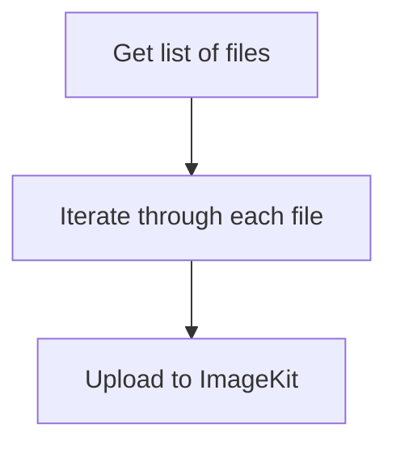

I've always hosted the images I use on this site on [Sirv](https://sirv.com/) since I started using this domain. It's an image CDN that optimises and delivers your images faster.

## Why I'm changing from Sirv

I've been using Sirv to optimise the images on my website since I started blogging, and it's been fantastic. It has everything I expected and more: picture optimisation, url scaling and cropping, image overlays, caching, and more. The monthly bandwidth on Sirv's free plan was insufficient for my website, therefore I opted to move away from them. It was fine for me at first, but as my website grew and I received more and more visits, my bandwidth usage went high.

The free plan provides 500 MB of storage and a monthly bandwidth of 2 GB.


The image above shows the bandwidth usage from April 30 to May 6, and it's 1.37 GB, a few megabytes shy of 2 GB. Therefore, I had to look for another solution. I would have been OK if I had upgraded to the business plan, but I'm kinda broke, so I must look for free options that will meet my needs. After much investigation, the best alternative was [ImageKit](https://imagekit.io/), which provided 20 GB of storage and 20 GB of bandwidth, just what I was looking for:relieved:.

## Coding the migration script

As a developer, I tend to automate most things. I could have migrated image by image, but that would take a century before I was done, so I decided to use Python to quicken the process.

### How The Script Will Work



The image above demonstrates how our programme will operate. We will first retrieve a list of all our images from Sirv, then iterate through all the files and upload it to ImageKit. It is quite simple.

**Getting list of files**

The first method is very easy, we are going to make Sirv export a CSV file which will contain a list of all the files on their server. Head over to your ["My files"](https://my.sirv.com/#/browse/) directory on Sirv. Then you right-click an empty area and select "Export file list to CSV".
Now, this will download a CSV file onto your device.

### Installing Required Packages

We will need to install some packages to make our script work. The only package which we will be installing is the ImageKit SDK.
To install it, just open your terminal and paste the following code.

```shell
pip install imagekitio
```

Create a new Python file and put the following code inside after the package has been successfully installed.

```python
import csv
from imagekitio import ImageKit

imagekit = ImageKit(
	private_key = "xxxxxxxxxxxxxxxxxxxxxxxxxxxxxxxxxx",
	public_key = "xxxxxxxxxxxxxxxxxxxxxxxxxxxxxxxxxxx",
	url_endpoint = "https://ik.imagekit.io/your_endpoint/"
	)


with open("file-list.csv") as csv_file:
	csv_reader = csv.DictReader(csv_file)
	for row in csv_reader:
		line = dict(row)
		folder = line["File"].split("/")[:-1]
		folder.append("")
		folder = "/".join(folder)
		if line['Type'] != "folder":
			imagekit.upload_file(
				file = line["URL"],
				file_name = line["Name"],
				options = {
					"use_unique_file_name": False,
					"folder": folder
				}
				)
		print("Uploaded " + line["Name"])
```

You only need the code above. First, we included the CSV and ImageKit packages. Then we built an ImageKit instance. You must replace `private_key` and `public_key` with the private key and public key of your account, accordingly. Then you replace `url_endpoint` with the endpoint for your account.

In the following line, we opened the CSV file (which I renamed 'file-list.csv' after downloading it from Sirv) and built a CSV reader.

The files are then uploaded to ImageKit once we go over the data in the CSV file.

## Outro

So this is how I transferred all of my images from Sirv to ImageKit. The procedure described here will also move your images to ImageKit. If you run across any issues, please post them in the comments area.