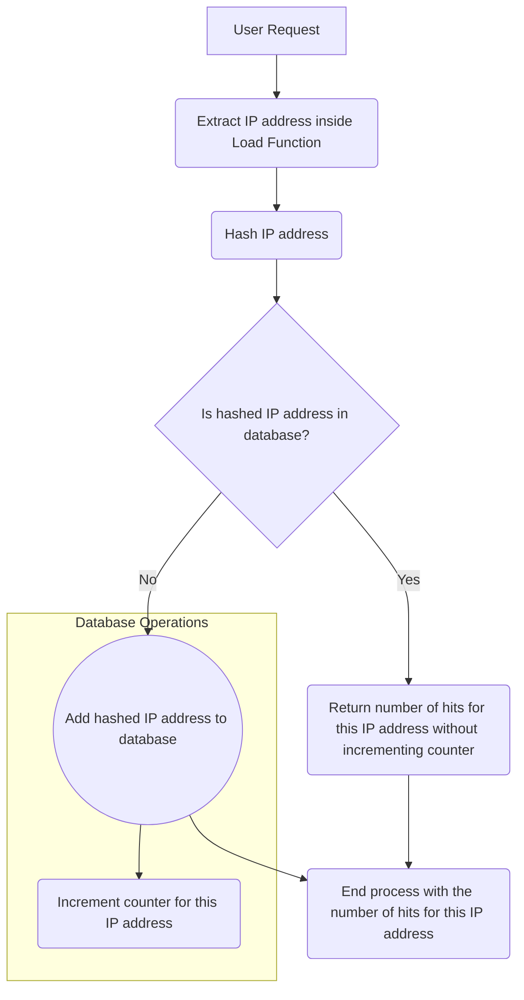

<!--TODO: Rewrite this article later-->

My website now has a page hit counter which I recently installed. I added it directly to my blog section. This allows me to know how many times my blog posts have been viewed as well as which blog posts are popular. Today, I decided to jot down everything I did.

Basically, there are two types of hit counters;

1. Unique hit counter
   This form of a hit counter tracks the number of unique visits to the page. Each request requires the user's IP address, which is subsequently checked against a database. If the address does not exist, it is added to the database and the counter is incremented. If the address already exists in the database, the number is not increased meaning the user has visited the page before.
2. Basic hit counter
   This type of hit counter is the simplest. It just increments by one each time the page is accessed. Even when a user refreshes the page, the counter will be incremented.

Why did I need a hit counter?
The reason was simple, I needed to see how my articles performed. To know my popular articles, I will need a hit counter to see which articles were being read the most.

## Requirements

Okay, so first of all, if your SvelteKit website is hosted on a serverless platform, then this tutorial isn't for you. You also should be familiar with using sqlite.

We are going to use sqlite3 as our database to store our hit counts. We first begin by installing the `sqlite3` module.

```bash
npm install sqlite3
```

## How it's going to work



That's a pretty large diagram explaining all what we will be doing. Let me describe the process real quick.
When the user visits any blog post, we extract the I.P address and then we get the hash of the I.P address. Next, we check if the hashed value is inside the database for that particular blog post. If it is in, it means the user has visited that blog post before so we don't update our database. We just return the number of hashed I.P addresses excluding the current one. If the hashed I.P is not in the database, it means this is the first time the user is visiting so we 

## Directory Structure

So before we start, I want to give a clear overview of how the directory is structured so you won't find difficulties in understanding.

```
.
└── src/
    └── routes/
        └── blog/
            ├── _blog
            ├── [slug].svelte
            └── [slug].json.js
```

This is the directory structure of my website. I actually stripped some folders out since we won't be needing them. The files which we are going to be working with are `[slug].json.js` and `[slug].svelte`.
The `[slug].json.js` file is going to be our endpoint responsible for updating the data in the database and also retrieving the data

## The endpoint

Now, we are going to edit our `[slug].json.js` file.
Inside that file, paste this code, I will explain below

```javascript
import sqlite from "sqlite3"; //we import the sqlite module

const db = new sqlite.Database("./database.db", (err) => {}); //This command will create the database for us if it does not exist

db.serialize(() => {
	db.run(
		`
	CREATE TABLE IF NOT EXISTS blog	 (
		slug VARCHAR(255) UNIQUE NOT NULL,
		read_times INT DEFAULT 1 NOT NULL
	)
`,
		(err) => {}
	);
});
//Then over here we create our table which will store the hit counts

const getData = async (slug) => {
	/*
  this is the function responsible for fetching and updating the hit count
  */
	return new Promise((resolve, reject) => {
		db.serialize(() => {
			db.get("SELECT * FROM blog WHERE slug = ?", slug, async (err, rows) => {
				if (err) {
					reject(err);
				} else {
					if (rows === undefined) {
						let insert = new Promise((resolve, reject) => {
							db.run("INSERT INTO blog (slug) VALUES (?)", slug, (err, data) => {
								if (err) reject(err);
								else resolve({ read_times: 1, likes: 0, shares: 0 });
							});
						});
						try {
							let data = await insert;
							resolve(data);
						} catch (err) {
							reject(err);
						}
					} else {
						let times_read = rows.read_times;
						db.run(
							"UPDATE blog SET read_times = ? WHERE slug = ?",
							times_read + 1,
							slug,
							(err, data) => {}
						);
						resolve(rows);
					}
				}
			});
		});
	});
};

export const GET = async ({ params, query }) => {
	try {
		let results = new Object();
		let { slug } = params;
		let data = await getData(slug);
		results["data"] = data;
		return {
			headers: {
				"Cache-Control": "no-cache"
			},
			body: JSON.stringify(results)
		};
	} catch (err) {
		console.log(err);
		return {
			body: JSON.stringify(false)
		};
	}
};
```

So after importing the `sqlite` module, we created a new sqlite database instance and assigned it to the constant `db`. This will create a new file called `database.db` inside the root directory of your website and its where the data will be stored.

Then, we run a query to create the `blog` table if it doesn't exist.

The `getData` function is an asynchronous function which is responsible for fetching and updating the data in the database. It takes the slug as parameter, it first tries to retrieve the hit counts from the database, if the returned results is undefined, it means that's the first time a user is visiting the page so it runs an INSERT command. If the returned results is not undefined, it extracts the current hit counts and updates it + 1, then it returns the final data.

The `get` function is a function which is run when a request is being made to the endpoint. That's where we do the data fetching. We extract the slug from the request and use it to retrieve the data from the database, then we return it as a JSON response.

## The page

Now we have finished with our endpoint, it's now time to use it in our svelte page.
Edit your `[slug].svelte` file and paste the following code inside.

```svelte
<script context="module">
	export async function load({ page, fetch }) {
		const slug = page.params.slug;
		let { data } = await fetch(`/blog/${slug}.json`)
			.then((e) => e.json())
			.catch((err) => {});
		return {
			props: {
				data
			}
		};
	}
</script>

<script>
	export let data;
</script>

<div>
	<span>Read Times: {data.read_times} </span>

	<!-- Your blog article goes here -->
</div>
```

## Conclusion

So this is how I made the hit counter for my website, though it's very simple, you can extend it if you want :smile:
