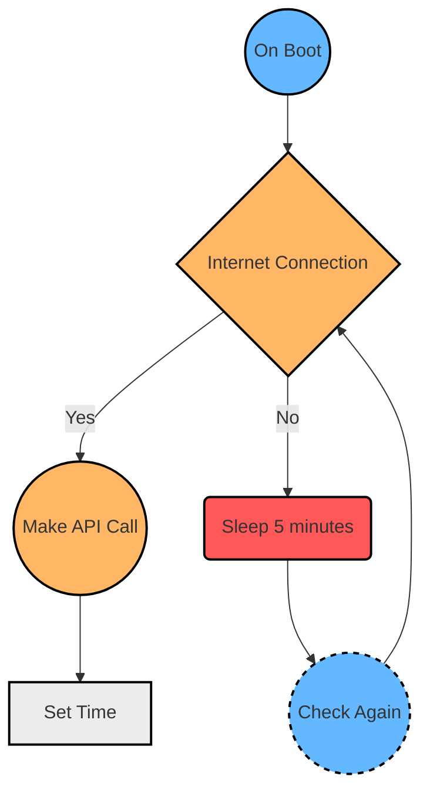

Setting your computer's time whenever something goes wrong might be tedious... Fortunately, the procedure can be automated.

When the CMOS battery inside my computer expired a few months ago, I had a problem with my computer's time. I had to set it on each boot, which was tedious, so I decided to write a Python script to automate the entire process.

## How it Works?

So, here's how the script works.



On boot, it makes a call to an API to get the current time based on the IP address. If there's no internet connection, it waits and tries again in 5 minutes. When it finally gets the time, it sets the computer's time.

## Writing the code

Here's the code for the script.

```python
import requests
from time import sleep
import json
import re
from subprocess import Popen

def set_current_time():
  """Function to return the current time"""
  try:
    res = requests.get("http://worldtimeapi.org/api/ip")
    data = res.text
    time_regex = r"\d+:\d+:\d+"
    datetime =  json.loads(data)['datetime']
    date = re.search(time_regex,datetime).group()
    Popen(['time',date],shell = True)
  except requests.exceptions.ConnectionError:
    sleep(3000)
    set_current_time()

set_current_time()
```

So that's the program's code. Using a regular expression, we obtain the date and time. The subprocess module is then used to execute a shell command, which sets the time. If a request is made to the API and no internet connection is available, it will wait 3000 seconds (5 minutes) before making another call to the server.

When you are done, save this file with a `.pyw` extension instead of `.py`, this will prevent the application from launching the console when it is running.
Finally, place this file inside `%appdata%/Microsoft/Windows/Start Menu/Startup`.
Restart your computer and see the magic.